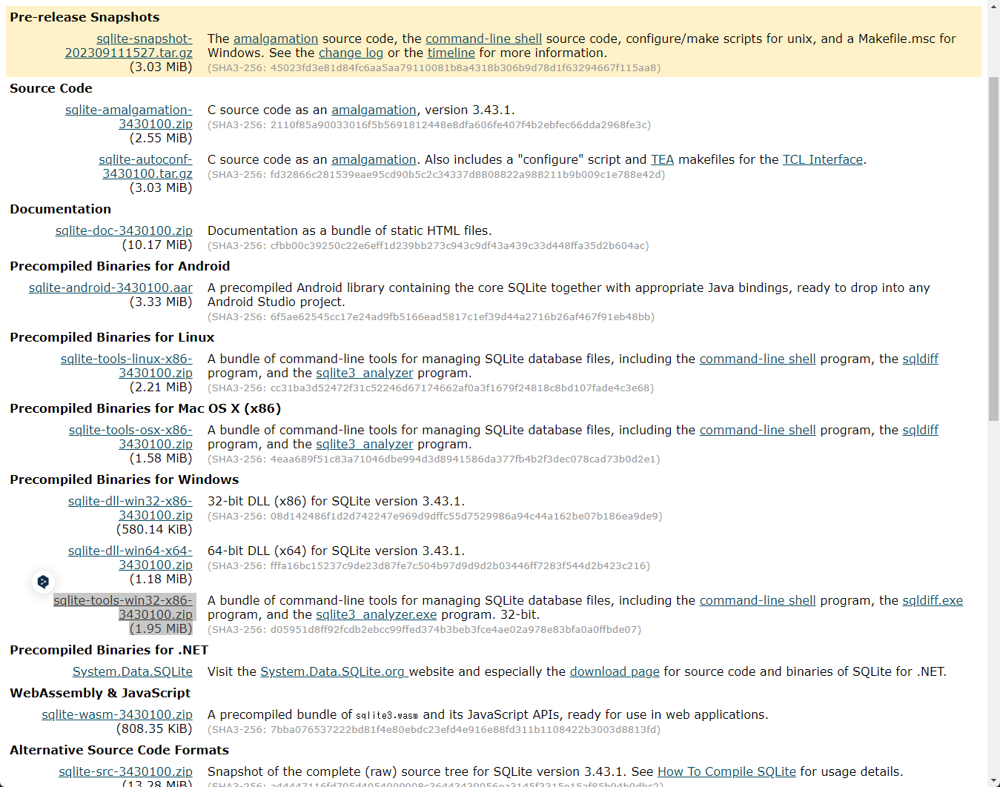
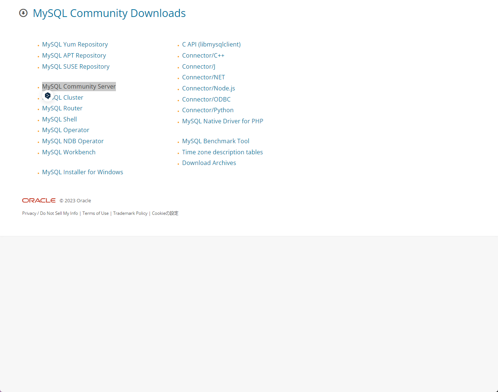
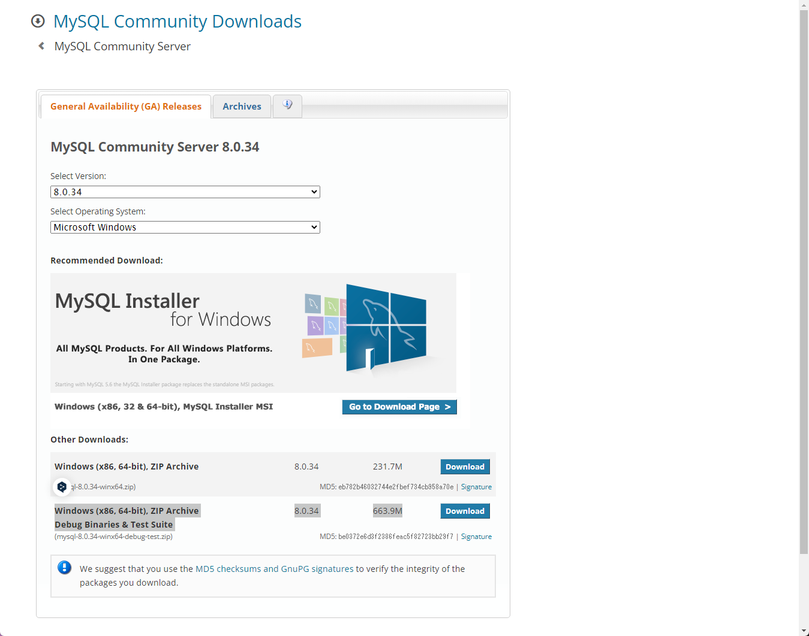

# Section 12.Database

# SQLite
https://www.sqlite.org/index.html
## Windowsで必要なインストール


# MySQL



## Dockerでのインストール
```
# docker pull mysql:8.0.34
docker pull mysql:latest
mkdir my_mysql_data
# docker run --name mysql-container -e MYSQL_ROOT_PASSWORD=password -d mysql:latest
docker run --name mysql-container `
  -e MYSQL_ROOT_PASSWORD=password `
  -v ${pwd}/138MySQL_mysql_data:/var/lib/mysql `
  -p 3306:3306 `
  -d mysql:latest

#  -v ${pwd}/my_mysql_data:/var/lib/mysql `

# docker execでの接続
docker exec -it mysql-container mysql -u root -p

# バージョン確認
SHOW VARIABLES LIKE "%version%";
+--------------------------+------------------------------+
| Variable_name            | Value                        |
+--------------------------+------------------------------+
| admin_tls_version        | TLSv1.2,TLSv1.3              |
| immediate_server_version | 999999                       |
| innodb_version           | 8.1.0                        |
| original_server_version  | 999999                       |
| protocol_version         | 10                           |
| replica_type_conversions |                              |
| slave_type_conversions   |                              |
| tls_version              | TLSv1.2,TLSv1.3              |
| version                  | 8.1.0                        |
| version_comment          | MySQL Community Server - GPL |
| version_compile_machine  | x86_64                       |
| version_compile_os       | Linux                        |
| version_compile_zlib     | 1.2.13                       |
+--------------------------+------------------------------+
13 rows in set (0.01 sec)

# データベース一覧
show databases;
+--------------------+
| Database           |
+--------------------+
| information_schema |
| mysql              |
| performance_schema |
| sys                |
+--------------------+
```
## MySQL 8.0以降で導入された新しい認証プラグイン caching_sha2_password をサポートを回避
発生するエラーメッセージ
```
 Authentication plugin 'caching_sha2_password' is not supported
```
### 対応方法： MySQLの権限設定
⇒クライアントライブラリを最新化するといい。
```
create database mydatabase;
CREATE USER 'myuser'@'%' IDENTIFIED BY 'password';
GRANT ALL PRIVILEGES ON mydatabase.* TO 'myuser'@'%';

GRANT ALL PRIVILEGES ON mydatabase.* TO 'root'@'%';
FLUSH PRIVILEGES;
```
## データベースについて
MySQLのシステムデータベースは、MySQLサーバーの操作と管理に必要な情報を格納し、提供するために存在します。それぞれのデータベースは独自の目的を持っており、以下のように説明されます。

1. **`information_schema`**:
   `information_schema`は、データベースのメタデータを提供する特殊なデータベースです。このデータベースには、他のデータベース、テーブル、カラム、インデックスなどの情報が含まれています。ユーザーはこのデータベースをクエリすることで、システムの構造とプロパティに関する情報を取得できます。

2. **`mysql`**:
   `mysql`データベースは、MySQLサーバーのシステムテーブルを保持します。これにはユーザーアカウント、権限、および他のサーバーの設定に関連する情報が含まれています。`mysql`データベースは、MySQLサーバーのセキュリティと構成を管理するために重要です。

3. **`performance_schema`**:
   `performance_schema`データベースは、サーバーのパフォーマンス診断に使用されるデータを提供します。これには、実行中のクエリ、サーバーのステータス、およびパフォーマンスに関連する他の多くのメトリクスが含まれています。

4. **`sys`**:
   `sys`データベースは、パフォーマンス分析やトラブルシューティングを簡単にするために設計されたビュー、関数、およびプロシージャを提供します。これは`performance_schema`および`information_schema`データベースの情報を利用し、より読みやすい形式で情報を提供します。

これらのシステムデータベースは、DBA（データベース管理者）や開発者がMySQLサーバーを効果的に管理、監視、およびトラブルシューティングするために重要です。

```
* Linux/Unix/MacOS: /etc/my.cnf または /etc/mysql/my.cnf
* Windows: C:\ProgramData\MySQL\MySQL Server 8.0\my.ini
```conf
# /etc/my.cnf
# この設定がなくても外部から接続できます。
[mysqld]
bind-address = 0.0.0.0
```
### timeoutの確認
```
mysql> SHOW GLOBAL VARIABLES LIKE '%timeout%';
+-----------------------------------+----------+
| Variable_name                     | Value    |
+-----------------------------------+----------+
| connect_timeout                   | 10       |
| delayed_insert_timeout            | 300      |
| have_statement_timeout            | YES      |
| innodb_flush_log_at_timeout       | 1        |
| innodb_lock_wait_timeout          | 50       |
| innodb_rollback_on_timeout        | OFF      |
| interactive_timeout               | 28800    |
| lock_wait_timeout                 | 31536000 |
| mysqlx_connect_timeout            | 30       |
| mysqlx_idle_worker_thread_timeout | 60       |
| mysqlx_interactive_timeout        | 28800    |
| mysqlx_port_open_timeout          | 0        |
| mysqlx_read_timeout               | 30       |
| mysqlx_wait_timeout               | 28800    |
| mysqlx_write_timeout              | 60       |
| net_read_timeout                  | 30       |
| net_write_timeout                 | 60       |
| replica_net_timeout               | 60       |
| rpl_stop_replica_timeout          | 31536000 |
| rpl_stop_slave_timeout            | 31536000 |
| slave_net_timeout                 | 60       |
| ssl_session_cache_timeout         | 300      |
| wait_timeout                      | 28800    |
+-----------------------------------+----------+
23 rows in set (0.01 sec)
```

## Pythonの設定
```
pip install PyMySQL
pip install mysqlclient

# install mysql-connector-python
pip install mysql-connector-python==8.1.0

# MySQLコネクタをアップデートする:
# 最新バージョンのMySQLコネクタ（例: mysql-connector-python）をインストールすることで、caching_sha2_passwordプラグインをサポート
pip install --upgrade mysql-connector-python
```

# SQL Alchemyを使う

```
pip install SQLAlchemy

pip install pymysql

```
# dbmを使う
### サーバ側の準備
https://github.com/kiyo7447/Local-Databases/tree/main/memcached
## 端末側の準備
```bash
pip install python-memcached
```
# memcached
## サーバの準備
https://github.com/kiyo7447/Local-Databases/tree/main/memcached

## ソースコード
DBの前に立てて、キャッシュサーバの役割を果たす。
# MongoDB
## サーバの準備
https://github.com/kiyo7447/Local-Databases/tree/main/MongoDB
## ソースコード
### 集計機能を提供するAggregation Pipelineを使う
MongoDBのAggregationsは、データの変換と組み合わせを行うためのフレームワークです。これにより、データの処理と分析を行い、計算された結果を得ることができます。Aggregationsは、データのグループ化、フィルタリング、変換など、多くの操作を実行できる非常に強力で柔軟なツールを提供します。

MongoDBのAggregationsは主に以下の3つの方法で実行できます:

1. **Aggregation Pipeline**:
   - この方法では、データは複数のステージを通過し、各ステージで特定の操作が実行されます。ステージは連鎖的に実行され、一つのステージの出力は次のステージの入力となります。これにより、データのフィルタリング、変換、ソート、グループ化など、複雑なデータ処理を実行できます。

2. **Map-Reduce**:
   - Map-Reduceは、大量のデータを処理し、集計するためのスケーラブルな方法を提供します。Map関数とReduce関数を使用して、キーと値のペアを生成し、集計します。

3. **Single Purpose Aggregation Methods**:
   - これらは特定の単一目的の集計タスクを実行するためのシンプルなメソッドです。例えば、`db.collection.count()`や`db.collection.distinct()`などがあります。

以下は、Aggregation Pipelineを使用した簡単な例です:

```javascript
# ステータスがAの売上金額を集計する
result = col.aggregate([
   { "$match": { "status": "A" } },
   { "$group": { "_id": "$status", "total": { "$sum": "$price" } } }
])
```

この例では、まず`$match`ステージで`status`が"A"であるドキュメントをフィルタリングし、次に`$group`ステージで顧客ID(`cust_id`)ごとに注文金額を合計しています。

Aggregationsは、データ分析、レポート生成、データクレンジング、データ変換など、多くのユースケースにおいて非常に役立ちます。
# Hbase
う～ん。Pythonでうまく動かない。。。

# TODO
# DBM
# pickle
# neo4j
