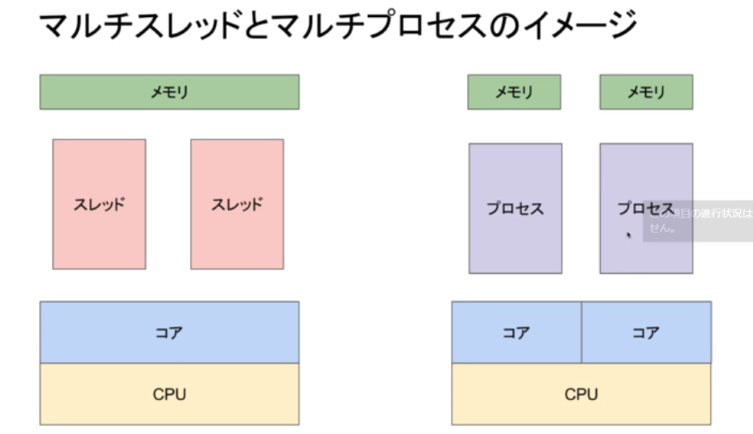

# 並列化
## Multi Thrad
Multi Threadは、1つのプロセス内で複数のスレッドを同時に実行することができるプログラミング手法です。スレッドは、プロセス内のリソースを共有するため、プロセス間通信のオーバーヘッドが少なく、効率的に並列処理を行うことができます。Pythonでは、threadingモジュールを使用してMulti Threadを実現することができます。
## Multi Process
Multi Processは、1つのプロセス内で複数のプロセスを同時に実行することができるプログラミング手法です。プロセスは、それぞれ独立したリソースを持つため、プロセス間通信のオーバーヘッドが発生しますが、複数のCPUコアを利用することができるため、効率的に並列処理を行うことができます。Pythonでは、multiprocessingモジュールを使用してMulti Processを実現することができます。

# 