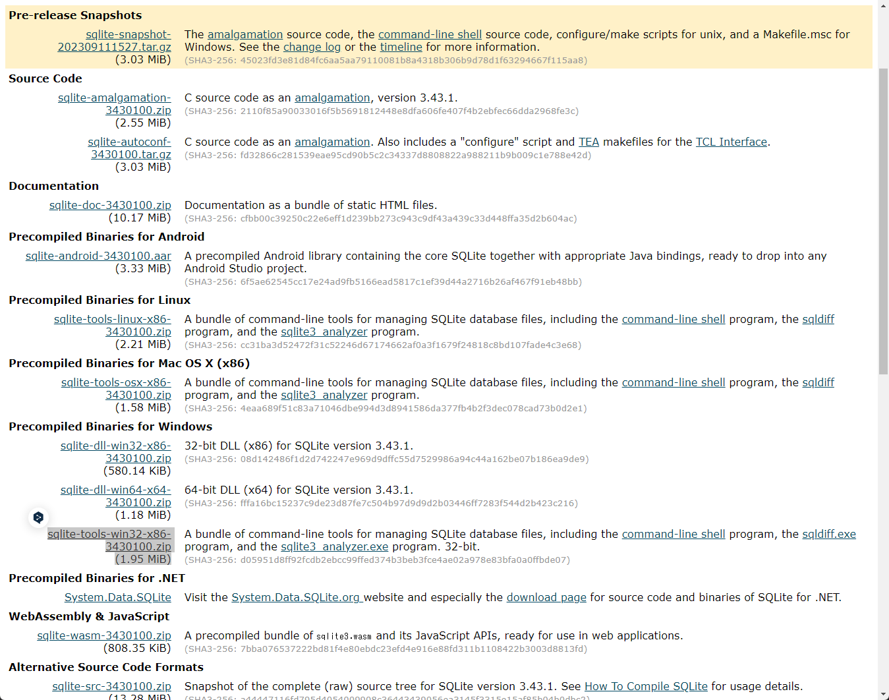
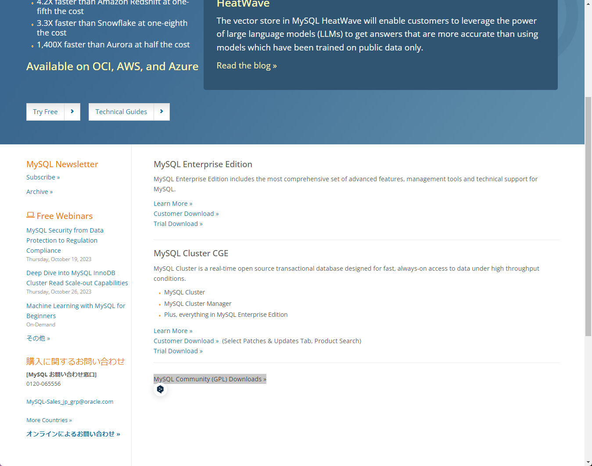
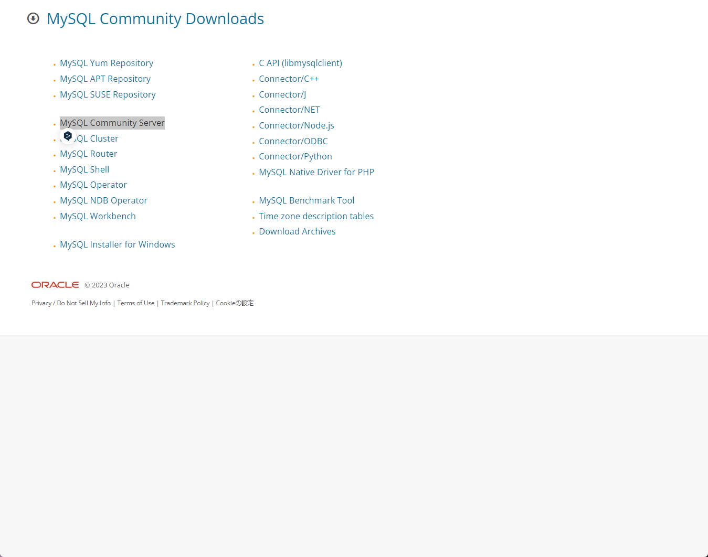
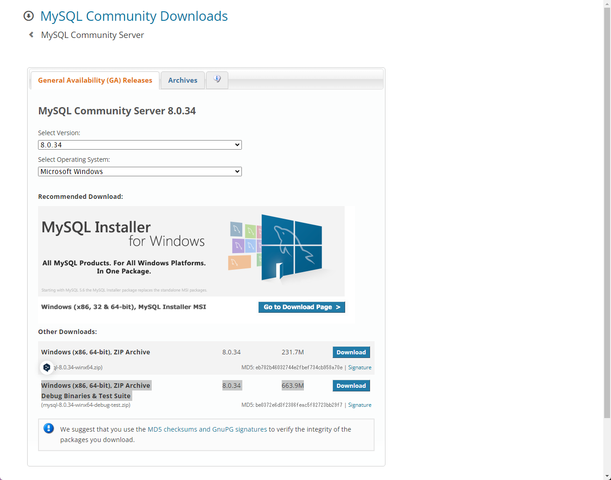

# 何処の情報をまとめたのか？

UdemyのPython講座を受講した時のメモをまとめたものです。
現役シリコンバレーエンジニアが教えるPython 3 入門 + 応用 +アメリカのシリコンバレー流コードスタイル
https://tmnets.udemy.com/course/python-beginner/learn/lecture/8509966?learning_path_id=4835268#overview

https://tmnets.udemy.com/course/python-beginner/learn/lecture/8393044?learning_path_id=4835268#overview

GitHub


# Pythonの文字化け調査
Visual Studio Code (VSCode)では、一部の設定を調整することで文字化け問題を解消できる場合があります。以下のステップを試してみてください。

1. **VSCodeの設定を開く**: "File" メニューから "Preferences" を選択し、その後 "Settings" をクリックします。または、`Ctrl + ,` を押すことで直接設定画面を開くことも可能です。

2. **検索バーに"terminal.integrated.env.windows"を入力する**: この設定項目は、VSCodeのターミナルで使用される環境変数を管理します。

3. **環境変数に新しい設定を追加する**: "Edit in settings.json" をクリックします。そうすると設定ファイルが開かれます。ここに次の行を追加します（すでに何かしらの設定がある場合は、その中に追加してください）:

    ```json
    "terminal.integrated.env.windows": {
        "PYTHONIOENCODING": "utf-8:surrogateescape"
    }
    ```

4. **VSCodeを再起動する**: 上記の設定を適用するために、VSCodeを再起動します。

上記の設定により、VSCodeの統合ターミナルでPythonが出力する文字列のエンコーディングがUTF-8に設定されます。これにより、日本語の文字化けが解消される可能性があります。

なお、VSCodeの統合ターミナルを使用していない場合、または上記の手順が問題を解決しない場合は、使用しているPythonの実行環境やコード、エラーメッセージなどの詳細情報が必要となります。


# VSCodeでの調査
Visual Studio Code（VSCode）でPythonのデバッグ実行を行うときに日本語が文字化けする問題は、VSCodeのPython拡張機能の設定を変更することで解消できる場合があります。

以下のステップを試してみてください：

1. **VSCodeの設定を開く**: "File" メニューから "Preferences" を選択し、その後 "Settings" をクリックします。または、`Ctrl + ,` を押すことで直接設定画面を開くことも可能です。

2. **検索バーに"Python"を入力し、Pythonの設定項目を見つける**: "Python"と入力すると、VSCodeのPython拡張機能に関連する設定項目が表示されます。

3. **"Python > Terminal: Execute In File Dir" の設定を有効にする**: この設定を有効にすると、VSCodeはPythonファイルがあるディレクトリでコードを実行します。これにより、VSCodeのPython拡張機能はUTF-8エンコーディングを正しく認識するようになる可能性があります。

4. **"Python > Terminal: Env"の設定を変更する**: ここで新しい環境変数を追加します。具体的には、「Edit in settings.json」をクリックして設定ファイルを開き、次の行を追加します:

    ```json
    "python.terminal.executeInFileDir": true,
    "python.env": {
        "PYTHONIOENCODING": "utf-8:surrogateescape"
    }
    ```

5. **VSCodeを再起動する**: 上記の設定を適用するために、VSCodeを再起動します。

以上の設定で、デバッグ時の日本語文字化け問題が解消されることを願っています。

なお、これでも解決しない場合は、具体的なエラーメッセージや使用しているPythonのコードなどの詳細情報が必要となります。それに基づいて、より具体的な解決策を提案することが可能です。


# コードスタイrのチェック
## ３つのコードスタイルチェッカー
1. pep8  
チェックはライト  
pip install pep8
1. flake8  
pip install flake8
1. pylint
チェックは厳しい  
pip install  
pylint


# 12.Database
## SQLite
https://www.sqlite.org/index.html
### Windowsで必要なインストール

## MySQL



### Dockerでのインストール
```
# docker pull mysql:8.0.34
docker pull mysql:latest
mkdir my_mysql_data
# docker run --name mysql-container -e MYSQL_ROOT_PASSWORD=password -d mysql:latest
docker run --name mysql-container `
  -e MYSQL_ROOT_PASSWORD=password `
  -v ${pwd}/my_mysql_data:/var/lib/mysql `
  -p 3306:3306 `
  -d mysql:latest
# 接続
docker exec -it mysql-container mysql -u root -p
# バージョン確認
SHOW VARIABLES LIKE "%version%";
# データベース一覧
show databases;
```
* Linux/Unix/MacOS: /etc/my.cnf または /etc/mysql/my.cnf
* Windows: C:\ProgramData\MySQL\MySQL Server 8.0\my.ini
```conf
# /etc/my.cnf
# この設定がなくても外部から接続できます。
[mysqld]
bind-address = 0.0.0.0
```
* MySQLの権限設定
```
create database mydatabase;
CREATE USER 'myuser'@'%' IDENTIFIED BY 'password';
GRANT ALL PRIVILEGES ON mydatabase.* TO 'myuser'@'%';

GRANT ALL PRIVILEGES ON mydatabase.* TO 'root'@'%';
FLUSH PRIVILEGES;
```
# timeoutの確認
```
mysql> SHOW GLOBAL VARIABLES LIKE '%timeout%';
+-----------------------------------+----------+
| Variable_name                     | Value    |
+-----------------------------------+----------+
| connect_timeout                   | 10       |
| delayed_insert_timeout            | 300      |
| have_statement_timeout            | YES      |
| innodb_flush_log_at_timeout       | 1        |
| innodb_lock_wait_timeout          | 50       |
| innodb_rollback_on_timeout        | OFF      |
| interactive_timeout               | 28800    |
| lock_wait_timeout                 | 31536000 |
| mysqlx_connect_timeout            | 30       |
| mysqlx_idle_worker_thread_timeout | 60       |
| mysqlx_interactive_timeout        | 28800    |
| mysqlx_port_open_timeout          | 0        |
| mysqlx_read_timeout               | 30       |
| mysqlx_wait_timeout               | 28800    |
| mysqlx_write_timeout              | 60       |
| net_read_timeout                  | 30       |
| net_write_timeout                 | 60       |
| replica_net_timeout               | 60       |
| rpl_stop_replica_timeout          | 31536000 |
| rpl_stop_slave_timeout            | 31536000 |
| slave_net_timeout                 | 60       |
| ssl_session_cache_timeout         | 300      |
| wait_timeout                      | 28800    |
+-----------------------------------+----------+
23 rows in set (0.01 sec)
```

### Pythonの設定
```
# install mysql-connector-python
pip install mysql-connector-python==8.1.0
```


# SQL Alchemyを使う

```
pip install SQLAlchemy

pip install pymysql

```
# dbmを使う

## TODO
SQL Alchemyをやってみ
